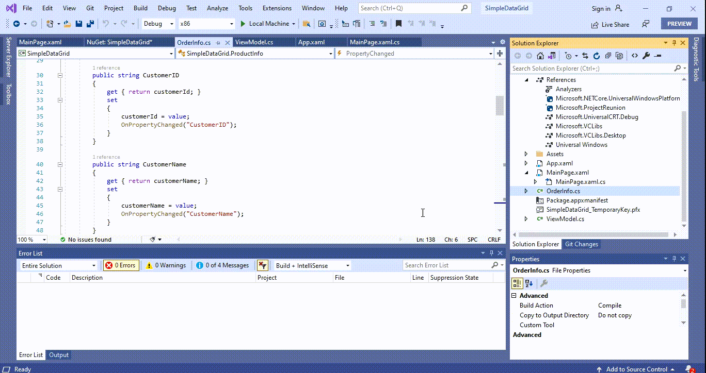

# How to create WinUI DataGrid (SfDataGrid)?

## About the sample
This example illustrates how to create [WinUI DataGrid](https://www.syncfusion.com/winui-controls/datagrid) (SfDataGrid)?

[WinUI DataGrid](https://www.syncfusion.com/winui-controls/datagrid) (SfDataGrid) is used to display and manipulate tabular data. Its rich feature set includes functionalities like data binding, editing, sorting, filtering, and grouping. It has also been optimized to work with millions of records, as well as to handle high-frequency, real-time updates. 

## Creating an application with WinUI DataGrid
   1. Create a [WinUI 3 desktop app for C#](https://docs.microsoft.com/en-us/windows/apps/winui/winui3/get-started-winui3-for-desktop) and .NET 5 or [WinUI 3 app in UWP for C#](https://docs.microsoft.com/en-us/windows/apps/winui/winui3/get-started-winui3-for-uwp).                
   2. Add reference to [Syncfusion.Grid.WinUI](https://www.nuget.org/packages/Syncfusion.Grid.WinUI) NuGet. 
   3. Import the control namespace Syncfusion.UI.Xaml.DataGrid in XAML or C# code.
   4. Initialize the SfDataGrid control.

```XML

<Page
    x:Class="SfDataGridDemo.MainPage"
    xmlns="http://schemas.microsoft.com/winfx/2006/xaml/presentation"
    xmlns:x="http://schemas.microsoft.com/winfx/2006/xaml"
    xmlns:local="using:SfDataGridDemo"
    xmlns:d="http://schemas.microsoft.com/expression/blend/2008"
    xmlns:mc="http://schemas.openxmlformats.org/markup-compatibility/2006" 
    xmlns:syncfuion="using:Syncfusion.UI.Xaml.DataGrid"
    mc:Ignorable="d"
    Background="{ThemeResource ApplicationPageBackgroundThemeBrush}">

    <Page.DataContext>
        <local:ViewModel />
    </Page.DataContext>
    
    <Grid>
        <syncfuion:SfDataGrid ItemsSource="{Binding Orders}" />
    </Grid>
</Page>

```



Take a moment to peruse the [WinUI DataGrid – Getting Started](https://help.syncfusion.com/winui/datagrid/getting-started) documentation, where you can find about [WinUI DataGrid](https://www.syncfusion.com/winui-controls/datagrid) (SfDataGrid) with code examples.

## Requirements to run the demo
Visual Studio 2019 and above versions
